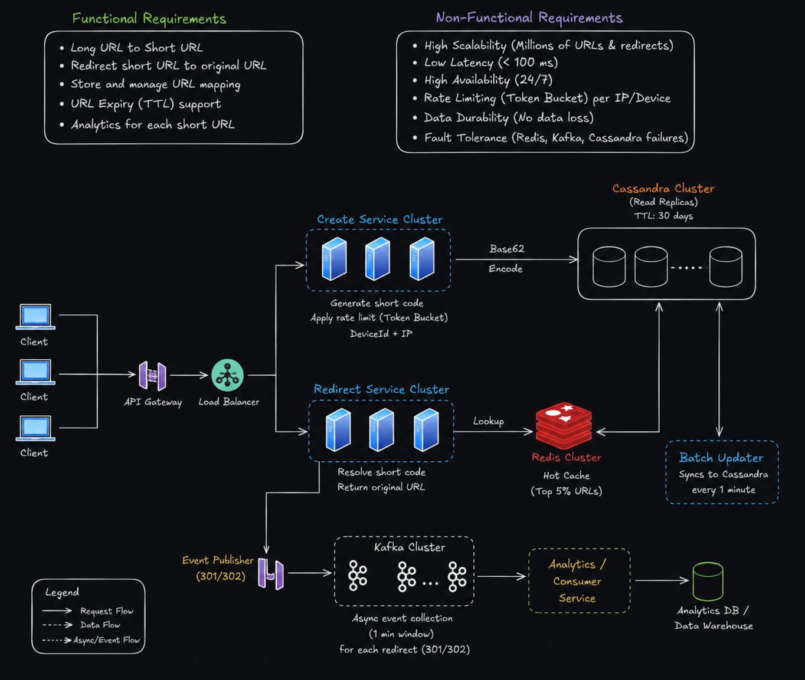

# URL Shortener System Design

## Overview

This project presents the high-level system design of a scalable URL Shortener service similar to Bit.ly or TinyURL. The system is designed to efficiently generate short URLs, redirect users to original URLs, and collect analytics while maintaining high scalability and low latency.

---

## Functional Requirements

- Convert Long URL to Short URL
- Redirect Short URL to Original URL
- Store URL Mapping
- Support URL Expiration (TTL)
- Collect Click Analytics

---

## Non-Functional Requirements

- High Scalability (Millions of URLs and Redirects)
- Low Latency (<100 ms)
- High Availability
- Fault Tolerance
- Data Durability
- Rate Limiting using Token Bucket Algorithm

---

## Architecture

---

## Components

### 1. Client
Users send requests to create or access shortened URLs.

### 2. API Gateway
Acts as the entry point and routes requests to the appropriate services.

### 3. Load Balancer
Distributes incoming traffic across multiple service instances to ensure high availability.

### 4. Create Service Cluster
Responsible for:
- Generating unique IDs
- Base62 Encoding
- Applying Rate Limiting
- Saving URL mappings

### 5. Redirect Service Cluster
Responsible for:
- Looking up short URLs
- Returning the original URL
- Publishing redirect events for analytics

### 6. Redis Cache
Stores frequently accessed ("hot") URLs to reduce database lookups and improve response time.

### 7. Cassandra Database
Stores URL mappings permanently.
Supports:
- Read Replicas
- TTL (Time-to-Live)
- High Write Throughput
- Horizontal Scaling

### 8. Kafka
Processes redirect events asynchronously without affecting user response time.

### 9. Analytics Service
Consumes Kafka events and generates click statistics.

### 10. Analytics Database
Stores analytics such as:
- Click Count
- Daily Visits
- Device Information
- Geographic Statistics

---

## Request Flow

### URL Creation

1. Client sends a long URL.
2. Request passes through API Gateway and Load Balancer.
3. Create Service generates a unique Base62 short code.
4. URL mapping is stored in Cassandra.
5. Short URL is returned to the client.

---

### URL Redirection

1. Client requests the short URL.
2. Redirect Service checks Redis Cache.
3. If found (Cache Hit), the original URL is returned.
4. Otherwise (Cache Miss), Cassandra is queried.
5. Redirect events are published to Kafka.
6. Analytics Service stores click data.

---

## Technologies Used

| Component | Technology |
|-----------|------------|
| API Gateway | Kong / Nginx |
| Load Balancer | HAProxy / Nginx |
| Cache | Redis |
| Database | Cassandra |
| Messaging | Apache Kafka |
| Encoding | Base62 |
| Analytics | Analytics Service + Analytics Database |

---

## Future Improvements

- Custom aliases
- User authentication
- QR Code generation
- URL Preview
- Spam Detection
- Distributed ID Generator
- Monitoring using Prometheus & Grafana

---

## Author

**Kavya Goyal**
**UID-24BCS12784**

BE CSE
