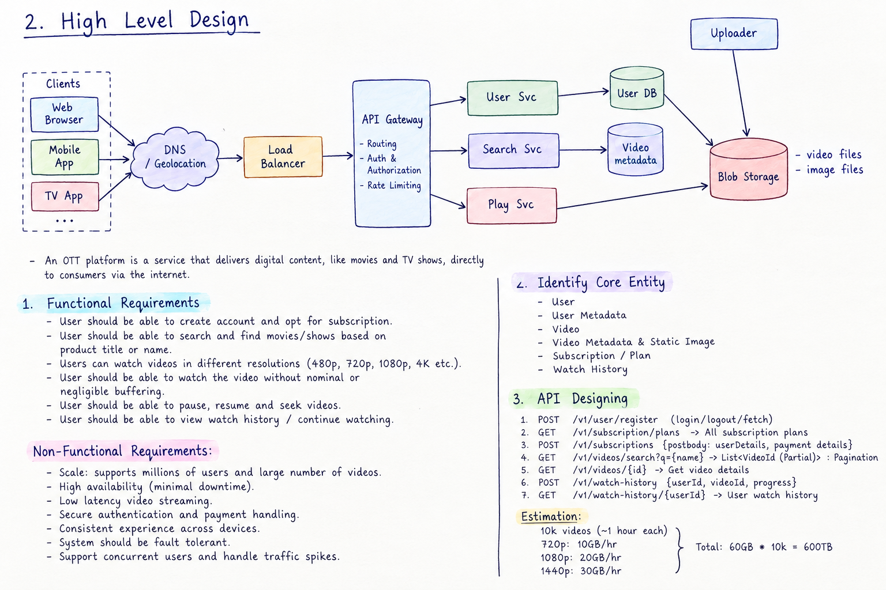

# Experiment 2 — Netflix High Level Design

**Name:** Kavya Goyal  
**UID:** 24BCS12784  
**Section:** 617_B  
**Subject:** System Design  
**Experiment:** 2

---

## Introduction

An **OTT platform** is a service that delivers digital content such as movies and TV shows directly to consumers through the Internet.

In this experiment, we design a simple **Netflix-like High Level Design (HLD)** that supports users, video search and video playback.

---

# 1. Functional Requirements

1. User should be able to **create an account and opt for a subscription**.
2. User should be able to **login and logout**.
3. User should be able to **search and find movies/shows** based on title or name.
4. User should be able to **view video details**.
5. User should be able to **watch videos in different resolutions** such as 480p, 720p, 1080p and 4K.
6. User should be able to **pause, resume and seek** the video.
7. User should be able to **continue watching / view watch history**.
8. User should be able to watch videos with **minimum buffering** under normal network conditions.

---

## Non-Functional Requirements

- **Scalability:** The system should support a large number of users and videos.
- **High Availability:** The service should remain available even if an application server fails.
- **Low Latency:** Search and video-start requests should respond quickly.
- **Performance:** The system should support many users watching videos at the same time.
- **Reliability:** Video playback should have minimum failures and buffering.
- **Security:** User login and subscription information should be protected.
- **Fault Tolerance:** Failure of one server should not bring down the complete system.
- **Consistency:** Important user and subscription information should be stored reliably.

---

# 2. Identify Core Entities

### 1. User

Stores basic user information.

```text
User
----------------
user_id
name
email
password
created_at
```

### 2. User Metadata

Stores additional user/profile information.

```text
User Metadata
----------------
user_id
profile
subscription
preferences
```

### 3. Video

Represents the actual video content.

```text
Video
----------------
video_id
video_file
resolution
duration
```

### 4. Video Metadata

Stores information about movies and shows.

```text
Video Metadata
----------------
video_id
title
description
genre
language
duration
release_year
```

### 5. Static Image

Stores references to posters/thumbnails used for displaying content.

---

# 3. API Designing

### User APIs

```text
POST /v1/user/register
POST /v1/user/login
POST /v1/user/logout
GET  /v1/user/{userId}
```

### Subscription APIs

```text
GET  /v1/subscription/plans
POST /v1/subscriptions
```

### Video Search APIs

```text
GET /v1/videos/search?q={name}
GET /v1/videos/{videoId}
```

### Playback API

```text
GET /v1/videos/{videoId}/play
```

### Watch History

```text
POST /v1/watch-history
GET  /v1/watch-history/{userId}
```

---

# 4. High Level Design



## Architecture Flow

```text
Client
   ↓
DNS / Geolocation
   ↓
Load Balancer
   ↓
API Gateway
   ↓
User / Search / Playback Services
```

The **Load Balancer** distributes incoming requests between available application servers.

The **API Gateway** receives requests from clients and sends them to the required service.

---

## Main Components

### Client

The client can be:

- Web Browser
- Mobile App
- Smart TV App

The user uses the client to search and watch content.

### DNS / Geolocation

DNS helps the client find the required service endpoint. Geolocation can help route the user towards a suitable location.

### Load Balancer

The Load Balancer distributes incoming traffic so that one server does not receive all requests.

```text
             Load Balancer
             /     |     \
            ↓      ↓      ↓
         Server  Server  Server
```

### API Gateway

The API Gateway is the entry point for application requests.

It mainly handles:

- Routing
- Authentication
- Authorization
- Rate limiting

Example:

```text
Search Request   → Search Service
User Request     → User Service
Play Request     → Playback Service
```

### User Service

The User Service handles:

- Registration
- Login/logout
- User information
- Subscription-related user information

It communicates with the **User DB**.

### Search Service

The Search Service is responsible for finding movies/shows based on title or name.

It uses the **Video Metadata DB**.

### Playback Service

The Playback Service handles requests to start and manage video playback.

For actual video delivery, the system uses the **CDN** instead of sending the complete video through the application service.

### Cache

Cache stores frequently accessed information such as:

- Popular video information
- Frequently searched results
- Video metadata

This reduces repeated database requests.

### User DB

Stores user-related information such as account, profile and subscription information.

### Video Metadata DB

Stores information about videos, for example:

- Title
- Genre
- Description
- Language
- Duration

The complete video file is **not stored in this database**.

### CDN

CDN is used to deliver video content to users from a location closer to them.

```text
User → CDN → Video
```

This helps reduce latency and buffering.

### Blob Storage

Blob/Object Storage stores the actual large video files and image files.

```text
Video files
Image files
      ↓
Blob Storage
```

### Uploader

The uploader is used by the content/admin side to upload new movie/show files and images to storage.

---

# 5. Video Playback Flow

When a user wants to watch a video:

```text
1. User selects a video.
2. Client sends a request to the API Gateway.
3. API Gateway sends the request to Playback Service.
4. Playback Service checks the required user/video information.
5. Video is requested through the CDN.
6. CDN delivers video data to the client.
```

### Important Point

The **database stores video metadata**, while the **actual large video files are stored in Blob/Object Storage**.

The CDN is used to efficiently deliver the video to users.

---

# 6. Video Upload Flow

```text
Uploader
    ↓
Blob / Object Storage
    ↓
Video Files
Image Files
```

New movies/shows and their images can be uploaded to storage.

Videos can also be prepared in different resolutions such as:

```text
480p
720p
1080p
4K
```

so that the appropriate quality can be provided to the user.

---

# 7. Caching

A cache is used for frequently requested data.

```text
Client
  ↓
API Gateway
  ↓
Cache
  │
  ├── Cache Hit → Return data
  │
  └── Cache Miss
          ↓
       Database
```

Caching helps reduce database load and improves response time.

---

# 8. Scalability

The system can be scaled by adding more application servers.

```text
                 Load Balancer
                /      |      \
               ↓       ↓       ↓
             Server 1 Server 2 Server 3
```

If the number of users increases, more servers can be added.

Different services can also be scaled according to their traffic.

For example:

```text
Search Service     → more instances for high search traffic
Playback Service   → more instances for high playback requests
User Service       → more instances for high login/user traffic
```

---

# 9. High Availability

To improve availability:

- Use multiple application servers.
- Use a Load Balancer.
- Keep database backups.
- Use replicas where required.
- Use CDN for video delivery.
- Monitor server failures.
- Redirect traffic from failed servers to healthy servers.

---

# 10. Security

Basic security measures include:

- HTTPS/TLS
- Password hashing
- Authentication
- Authorization
- API rate limiting
- Input validation
- Secure handling of subscription information

---

# 11. Estimation

Assume:

- **10,000 videos**
- Average duration = **1 hour**
- 720p = **10 GB/hour**
- 1080p = **20 GB/hour**
- 1440p = **30 GB/hour**

Storage for one video:

```text
10 + 20 + 30
= 60 GB
```

For 10,000 videos:

```text
60 GB × 10,000
= 600,000 GB
≈ 600 TB
```

Therefore, the approximate base storage requirement is:

**600 TB**

> This is a simple academic estimate. Actual storage would be higher because of source files, additional resolutions/codecs, audio, subtitles, thumbnails and backups.

---

# 12. Why Load Balancer?

A Load Balancer distributes requests among multiple servers.

Without Load Balancer:

```text
Users
  ↓
One Server
```

With Load Balancer:

```text
Users
  ↓
Load Balancer
  ├──→ Server 1
  ├──→ Server 2
  └──→ Server 3
```

This prevents a single server from handling all traffic and improves availability.

---

# 13. Why API Gateway?

API Gateway provides one entry point for clients.

It performs:

- Request routing
- Authentication
- Authorization
- Rate limiting

It sends each request to the appropriate service.

---

# 14. Why CDN?

Video files are large and many users may watch videos at the same time.

Therefore, instead of sending all video traffic through application servers:

```text
Client → Application Server → Video
```

we use:

```text
Client → CDN → Video
```

This reduces load on the application layer and helps provide faster video delivery.

---

# 15. Why Not Store Video in Database?

The actual movie files are very large.

Therefore:

```text
Video Metadata DB
      ↓
Title, genre, duration, etc.

Blob/Object Storage
      ↓
Actual video files
```

This keeps the database focused on searchable/structured information while large files are handled by object storage.

---

# 16. Conclusion

The proposed Netflix HLD uses a simple architecture consisting of **DNS/Geolocation, Load Balancer, API Gateway, User Service, Search Service, Playback Service, databases, cache, CDN and Blob/Object Storage**.

The main design idea is to separate **application requests** from **large video delivery**. Application services handle user, search and playback-related requests, while the CDN delivers the actual video content from object storage.

This design provides a simple and scalable foundation for a Netflix-like OTT platform.
